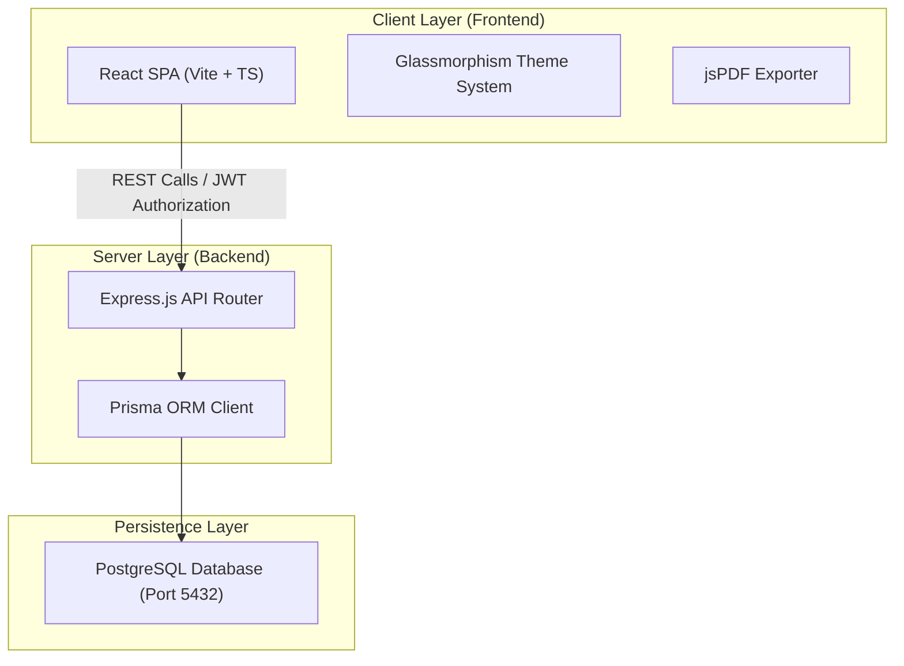

# 🌟 Mini ERP + CRM Operations Portal

<p align="center">
  
  
  
  
</p>

A premium, modern, and highly responsive **Mini ERP + CRM Operations Portal** tailored for wholesale and distribution enterprises. The system features a beautiful glassmorphic user interface and robust role-based access control (RBAC) across core modules.

---

## 🚀 Active Environment & URLs

* **🖥️ Local Frontend URL**: [http://localhost:5173](http://localhost:5173)
* **⚙️ Local Backend API URL**: [http://localhost:5000/api](http://localhost:5000/api)
* **🩺 Backend Health Endpoint**: [http://localhost:5000/health](http://localhost:5000/health)
* **📦 Core Repository Link**: [https://github.com/Ojasvimishra/Design-of-system-for-solving-the-issue-of-counterfeit-problam.git](https://github.com/Ojasvimishra/Design-of-system-for-solving-the-issue-of-counterfeit-problam.git)

---

## 🔑 Role-Based Access & Test Credentials

The application uses standard **JWT authentication** to authorize operations based on user roles. Use the credentials below to log in:

> 🔐 **Default Password for All Accounts:** `password123`

| User Role | Credentials / Email | Authorized Module Operations |
| :--- | :--- | :--- |
| <span style="color:#e53e3e; font-weight:bold;">🔴 Admin</span> | `admin@example.com` | Unlimited access (Client CRM, Inventory settings, Manual stock corrections, and Challans). |
| <span style="color:#d69e2e; font-weight:bold;">🟡 Sales</span> | `sales@example.com` | Create client files, edit CRM records, view inventory catalog, and create sales challans. |
| <span style="color:#319795; font-weight:bold;">🟢 Warehouse</span>| `warehouse@example.com` | Monitor inventory thresholds, perform manual stock adjustments (IN/OUT), and confirm challans. |
| <span style="color:#3182ce; font-weight:bold;">🔵 Accounts</span> | `accounts@example.com` | View customer portfolios, view product catalog, and cancel confirmed challans. |

---

## 📐 System Architecture



### Key Safety & Design Patterns
* 🔒 **Transactional Integrity**: Creating, confirming, and canceling challans is performed inside strict database-level ACID transactions to ensure zero-sum stock movements.
* 📸 **Historical Price Snapshots**: Challans capture the description and price of products at creation time to prevent modifications in the future from corrupting past accounting logs.
* 🎨 **Glassmorphism Design**: Designed with high-end glassmorphism style featuring modern typography, harmonious colors, shadows, and clean visual indicators.

---

## 📡 REST API Documentation

### 🔐 Authentications (`/api/auth`)
* `POST /api/auth/login` - Authenticate account and receive JWT token.
* `GET /api/auth/me` - Fetch profile details of the active JWT token owner.

### 👥 Customer CRM (`/api/customers`)
* `GET /api/customers` - Fetch complete client list.
* `GET /api/customers/:id` - Fetch single customer with follow-up communication histories.
* `POST /api/customers` - Create new customer record (Admin & Sales).
* `PUT /api/customers/:id` - Edit customer information (Admin & Sales).
* `POST /api/customers/:id/notes` - Add follow-up logs/conversation logs (Admin & Sales).

### 📦 Inventory Catalog (`/api/products`)
* `GET /api/products` - List all products, warehouse locations, and stock levels.
* `GET /api/products/:id` - Retrieve product details.
* `POST /api/products` - Register new product in catalog (Admin & Warehouse).
* `PUT /api/products/:id` - Update product details (Admin & Warehouse).
* `POST /api/products/:id/stock` - Post manual stock adjustments (IN/OUT) with audited logging.

### 🧾 Sales Challans (`/api/challans`)
* `GET /api/challans` - List all order challans.
* `GET /api/challans/:id` - Fetch specific challan including historical price snapshots.
* `POST /api/challans` - Save a new draft sales challan (Admin & Sales).
* `POST /api/challans/:id/confirm` - Confirm challan status and deduct stock (Admin, Sales & Warehouse).
* `POST /api/challans/:id/cancel` - Cancel challan and restore stock (Admin, Sales & Accounts).

---

## 🛠️ Step-by-Step Installation & Local Setup

### 🗄️ Database Setup
Ensure that a **PostgreSQL** instance is running locally on port **`5432`** using the credentials:
* **Host / Port**: `localhost:5432`
* **Username**: `postgres`
* **Password**: `Ojasvi@123`
* **Database Name**: `crm_db`

---

### ⚙️ Step 1: Configure & Start API Server
1. Navigate into the backend workspace folder:
   ```bash
   cd backend
   ```
2. Install the necessary project dependencies:
   ```bash
   npm install
   ```
3. Sync and push the Prisma database schema:
   ```bash
   npx prisma db push
   ```
4. Load initial database seeds (accounts, products, and clients):
   ```bash
   npm run prisma:seed
   ```
5. Spin up the backend server in development mode:
   ```bash
   npm run dev
   ```

---

### 💻 Step 2: Configure & Start Frontend
1. Open a new terminal command prompt and navigate to the frontend directory:
   ```bash
   cd frontend
   ```
2. Install client dependencies:
   ```bash
   npm install
   ```
3. Start the Vite React development server:
   ```bash
   npm run dev
   ```

---

## ⚠️ Known Limitations & Incomplete Elements

1. **User Sign-up Panel**: User account registration has no front-end user interface. New accounts must be created using SQL scripts, Prisma Studio, or seed scripts.
2. **Local Scope Presets**: Port mappings, database access configurations, and API URLs are configured for local environment testing. Deployment to external cloud providers (e.g. Render, Vercel) requires updating production connection strings and environment keys.
