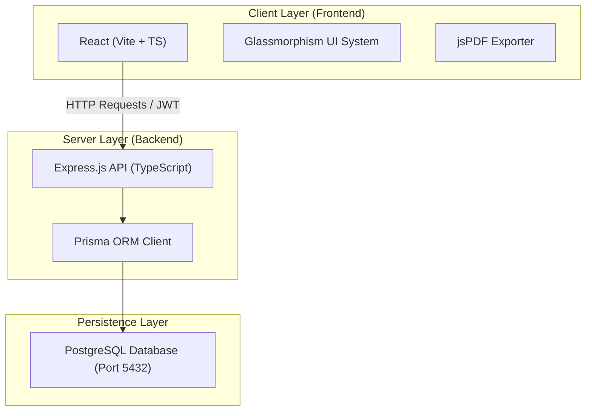

# Mini ERP + CRM Operations Portal Documentation

A modern, responsive, and robust Mini ERP + CRM Operations Portal built for wholesale/distribution businesses, complete with role-based views for Admin, Sales, Warehouse, and Accounts teams.

---

## 1. Project URLs & Repository

* **GitHub Repository URL**: [https://github.com/Ojasvimishra/Design-of-system-for-solving-the-issue-of-counterfeit-problam.git](https://github.com/Ojasvimishra/Design-of-system-for-solving-the-issue-of-counterfeit-problam.git)
* **Local Frontend URL**: [http://localhost:5173](http://localhost:5173)
* **Local Backend API URL**: [http://localhost:5000/api](http://localhost:5000/api)
* **Backend Health Check**: [http://localhost:5000/health](http://localhost:5000/health)

---

## 2. Test Login Credentials
*(All accounts share the default password: **`password123`**)*

| Role | Email | Key Permissions |
| :--- | :--- | :--- |
| **Admin** | `admin@example.com` | Full read/write access across all modules (CRM, Inventory, & Sales Challans) |
| **Sales** | `sales@example.com` | Manage client data, browse inventory levels, and create/confirm sales challans |
| **Warehouse** | `warehouse@example.com` | View live stock level indicators, log manual stock adjustments, and confirm pending challans |
| **Accounts** | `accounts@example.com` | Read-only view of customer accounts and catalog; authorization to cancel confirmed challans |

---

## 3. Architecture & Tech Stack



### Core Technologies
* **Frontend**: React SPA, Vite builder, Custom Glassmorphic CSS Theme, Lucide Icons, jsPDF.
* **Backend**: Node.js, Express.js Router, TypeScript, Prisma Client.
* **Database**: PostgreSQL (Prisma Client).

### Key Architectural Patterns
* **Role-Based Routing & Views**: The client decodes the user's role from the signed JWT payload, automatically updating visible dashboards, action buttons, and navigation options.
* **Transactional Safety**: Stock confirmation and cancellation logic run inside database-level ACID transactions. Inventory is safely deducted only when available, preventing race conditions or overselling.
* **Price Snapshotted Records**: When creating sales challans, current item prices are copied into a JSON snapshot within the invoice log. This prevents retroactive price changes in the product list from changing past accounting logs.

---

## 4. API Endpoints Reference

### Authentication Routing (`/api/auth`)
* `POST /api/auth/login` - Authenticate email & password, returns JWT token.
* `GET /api/auth/me` - Resolves details of the currently authenticated profile.

### Customer CRM Routing (`/api/customers`)
* `GET /api/customers` - Fetch complete list of active leads and clients.
* `GET /api/customers/:id` - Fetch customer file details including chronological follow-up notes.
* `POST /api/customers` - Register new customer.
* `PUT /api/customers/:id` - Update existing customer info.
* `POST /api/customers/:id/notes` - Append follow-up note.

### Inventory Catalog Routing (`/api/products`)
* `GET /api/products` - List all catalog items, warehouse locations, and stock levels.
* `GET /api/products/:id` - Fetch item details.
* `POST /api/products` - Create new inventory item profile (Admin & Warehouse only).
* `PUT /api/products/:id` - Update item specifications (Admin & Warehouse only).
* `POST /api/products/:id/stock` - Post a manual inventory correction (IN/OUT) with audited change log entries.

### Sales Challan Routing (`/api/challans`)
* `GET /api/challans` - Retrieve order list.
* `GET /api/challans/:id` - Retrieve order details and items.
* `POST /api/challans` - Log a new draft challan.
* `POST /api/challans/:id/confirm` - Confirm a challan, locking unit prices and subtracting products from active stock.
* `POST /api/challans/:id/cancel` - Cancel a challan, releasing products back into active stock.

---

## 5. Local Setup & Execution Guide

### Database Configuration
Ensure a PostgreSQL server is running locally on port **`5432`** using the workspace connection credentials:
* **Host**: `localhost`
* **Port**: `5432`
* **Username**: `postgres`
* **Password**: `Ojasvi@123`
* **Database**: `crm_db`

### Step 1: Set Up Backend Services
1. Navigate to backend workspace:
   ```bash
   cd backend
   ```
2. Install npm dependencies:
   ```bash
   npm install
   ```
3. Push database schema modifications:
   ```bash
   npx prisma db push
   ```
4. Load database seed details (mock accounts and stock items):
   ```bash
   npm run prisma:seed
   ```
5. Launch backend development server:
   ```bash
   npm run dev
   ```

### Step 2: Set Up Frontend Application
1. In a new command prompt, navigate to frontend workspace:
   ```bash
   cd frontend
   ```
2. Install npm dependencies:
   ```bash
   npm install
   ```
3. Launch React application server:
   ```bash
   npm run dev
   ```

---

## 6. Known Limitations
1. **User Administration Screens**: Adding new backend operators or editing accounts requires direct database insertions or executing custom scripts (no frontend user creation form is available).
2. **Local Deployment Scope**: All config properties (`PORT`, database credentials, and Vite build targets) are preset to test locally. Deploying to production services (e.g., Render or Vercel) requires configuring external cloud database connection URLs and environment properties.
